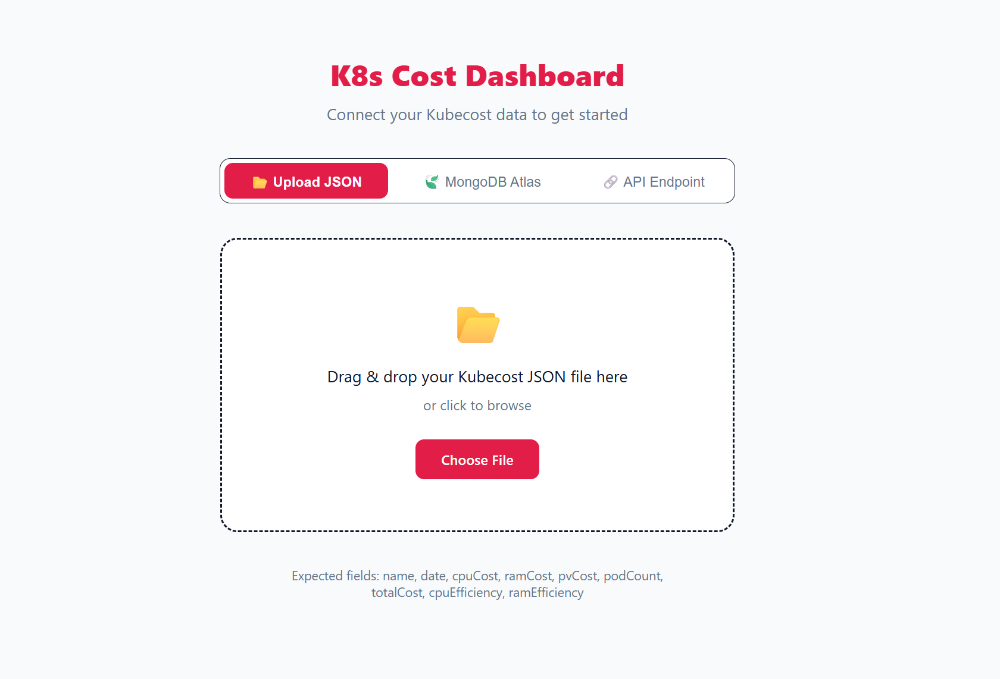
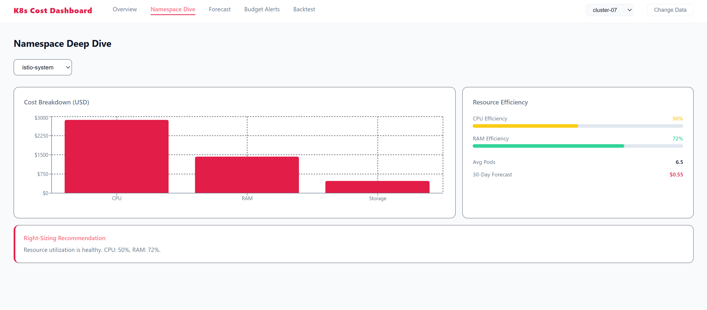
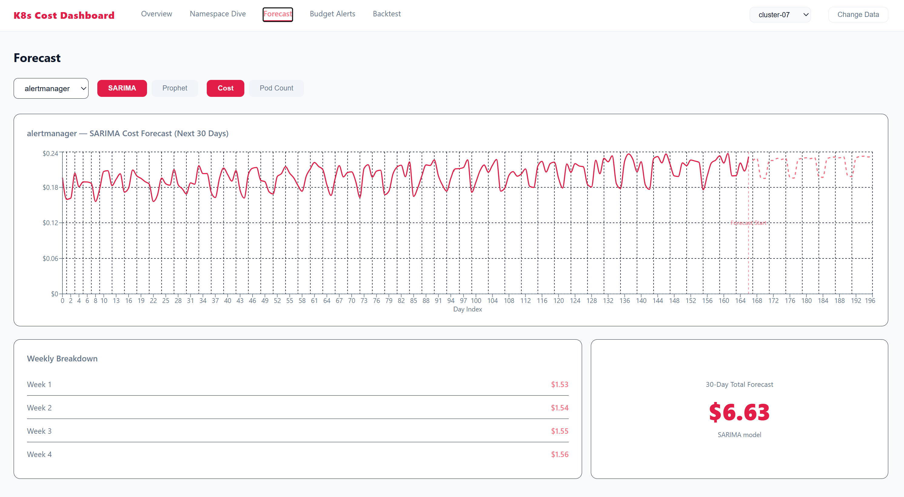
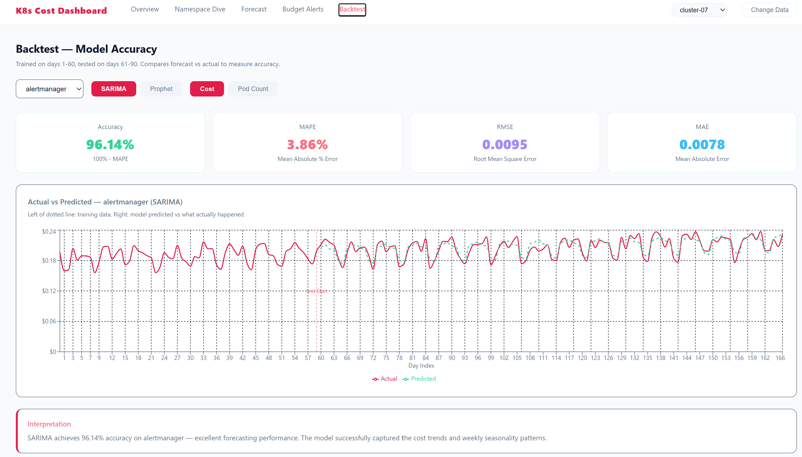
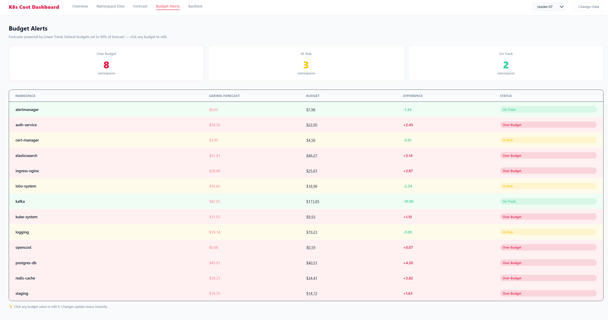

# Kubernetes Cost Analytics & Forecasting Dashboard

A full-stack web application for analyzing Kubernetes cost allocation data, visualizing spending trends, forecasting future costs, and monitoring budget usage.

Built during my software engineering internship to explore cost optimization techniques using Kubecost-style allocation data.

---

## Overview

This project provides an interactive dashboard for Kubernetes cost analysis. It supports multiple data sources, performs real-time analytics, visualizes historical cost trends, generates forecasts, and allows users to monitor namespace budgets across clusters.

The application was designed to handle both uploaded datasets and large MongoDB collections while maintaining responsive performance through backend optimizations.

---

## Features

### Dashboard Overview

- Cluster-wide cost summary
- Total infrastructure  xhow doies retreival augmented 
- Daily average cost
- Active namespaces
- Cost trend visualization
- Top cost-consuming namespaces

### Namespace Analytics

- Historical CPU, RAM, Storage and Total Cost
- Resource utilization metrics
- Pod count tracking
- Cost breakdown by namespace

### Forecasting

Supports multiple forecasting models:

- SARIMA
- Facebook Prophet

Forecasts include:

- 30-day prediction
- Weekly breakdown
- Historical vs forecast comparison
- Cost and Pod Count forecasting

### Forecast Backtesting

Evaluate forecasting performance using:

- MAPE
- RMSE
- MAE
- Forecast Accuracy

Supports backtesting for both:

- Cost
- Pod Count

### Budget Alerts

- Monthly cost prediction
- Editable namespace budgets
- Automatic budget status detection

Status indicators:

- On Track
- At Risk
- Over Budget

### Multi-Cluster Support

- Connect to MongoDB datasets containing multiple Kubernetes clusters
- Switch clusters without reconnecting
- Cluster-specific analytics and forecasting

---

## Data Sources

The application supports:

### MongoDB

Connect directly to a MongoDB database containing Kubecost allocation data.

### CSV Upload

Upload allocation datasets directly into the dashboard.

### REST API (Architecture Ready)

The application architecture supports consuming Kubernetes allocation data through REST APIs, allowing integration with external services instead of direct database access.

---

## Technologies Used

### Frontend

- React
- Recharts
- JavaScript
- CSS

### Backend

- FastAPI
- Python
- Pandas
- NumPy
- PyMongo

### Machine Learning / Forecasting

- Statsmodels (SARIMA)
- Prophet

### Database

- MongoDB

---

## Project Structure

```
project/
│
├── backend/
│   ├── main.py
│   ├── data_api.py
│   ├── forecasting.py
│   └── requirements.txt
│
├── frontend/
│   ├── src/
│   │   ├── components/
│   │   ├── pages/
│   │   └── App.js
│   └── package.json
│
└── README.md
```

---

## Sample Dataset

The application works with Kubecost-style allocation data containing fields such as:

- Namespace
- Cluster
- Date
- CPU Cost
- Memory Cost
- Persistent Volume Cost
- Pod Count
- Total Cost
- CPU Efficiency
- RAM Efficiency

Large synthetic datasets (50k–200k+ records) were generated to evaluate application performance and scalability.

---

## Performance Optimizations

During development several optimizations were implemented to improve responsiveness with large datasets.

Examples include:

- MongoDB indexing
- Cluster-based filtering
- Forecast result caching
- Reduced database queries
- Optimized aggregation pipelines
- Faster namespace loading
- Improved rendering performance for large datasets

---

## Forecasting Workflow

```
Historical Cost Data
          │
          ▼
Forecast Model
(SARIMA / Prophet)
          │
          ▼
30-Day Forecast
          │
          ▼
Budget Analysis
          │
          ▼
Alerts & Dashboard
```

---

## Screenshots

<h2>Dashboard Overview</h2>



<h2>Namespace Deep Dive</h2>



<h2>Forecast</h2>



<h2>Backtesting</h2>



<h2>Budget Alerts</h2>



---

## Future Improvements

- Authentication
- Role-based access control
- Scheduled forecast generation
- REST API integration with live Kubernetes environments
- Docker deployment
- Kubernetes deployment
- Email budget notifications
- Additional forecasting models (LSTM, XGBoost)

---

## Learning Outcomes

This project provided hands-on experience with:

- Full-stack application development
- FastAPI REST API development
- React dashboard design
- MongoDB integration
- Time series forecasting
- Kubernetes cost analytics
- Performance optimization
- Data visualization
- Backend architecture

---

## Author

**Architaa A**

Artificial Intelligence Intern

GitHub: *(https://github.com/Architaa-1010)*

LinkedIn: *www.linkedin.com/in/architaa-a-34936831b*

---